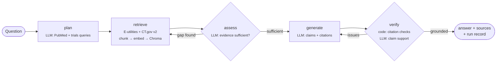

# Biomed Evidence Agent

An agentic RAG system that answers clinical-evidence questions from **PubMed** abstracts and
**ClinicalTrials.gov** records. Every claim is cited, checked against the retrieved sources, and
logged with full provenance.

> *"Does semaglutide reduce cardiovascular events in adults with obesity but no diabetes?"*
> → plans PubMed + registry searches, retrieves and ranks passages, checks whether the evidence
> covers the question (and searches again if not), drafts a cited answer, verifies every
> citation, revises once if anything fails, and returns the answer with its sources.

**Stack:** LangGraph · Claude (Anthropic SDK, structured outputs) · Hugging Face
sentence-transformers (BGE) · PyTorch · ChromaDB · FastAPI + SSE · React/TypeScript · Langfuse ·
Docker · GitHub Actions

---

## How it works



| Step | What happens | Why it matters |
|---|---|---|
| **plan** | Claude writes PubMed queries (boolean, MeSH) and a ClinicalTrials.gov term. | Librarian-style queries retrieve far better than pasting the question. |
| **retrieve** | Parallel async calls to NCBI E-utilities and the CT.gov v2 API. Records are chunked, embedded locally with `BAAI/bge-small-en-v1.5`, cached in Chroma, and ranked. At most 2 passages per source. | Re-asking reuses embeddings. The per-source cap keeps one long record from crowding out the rest. |
| **assess** | Claude decides whether the passages cover the question. If not, it proposes follow-up queries (bounded by `max_retrieval_rounds`). | Turns one-shot RAG into an agent that can recover from a weak first search. |
| **generate** | Structured output (`summary`, `claims[{text, citations}]`, `evidence_quality`, `limitations`). | Citations are data, not prose, so they can be checked. |
| **verify** | Code checks that every claim is cited and every cited id was actually retrieved. Then Claude judges whether each claim is supported by its cited passages. Failures go back to `generate` as reviewer feedback. | Catches made-up PMIDs and claims that overstate the evidence. |

Every LLM step returns a validated Pydantic model via the Anthropic SDK's `messages.parse`
(constrained JSON decoding), so no output is parsed from free text.

## Engineering for production

- **Evaluation:** [`evals/`](evals) holds 12 questions with known answers from landmark trials
  (SELECT, EMPEROR-Reduced, DAPA-CKD, SURMOUNT-1, CLARITY AD, ASPREE, VITAL, KEYNOTE-024,
  RECOVERY, ORION-10/11, CLEAR Outcomes, TOGETHER). It includes three null-result trials, to
  check that the agent doesn't overstate benefit. Every expected PMID and NCT id was looked up
  through the PubMed API, and the reference facts are taken from each paper's abstract
  conclusion. Metrics:
  - deterministic: source recall, citation validity, citation coverage, grounded rate
  - LLM-as-judge (a separate model): fact recall and finding direction
  - cost and latency for each question
- **Provenance and lineage:** each answer writes `.data/runs/<date>/<run_id>.json` with the code
  version (git SHA), model and prompt versions, every search query, a content hash of every
  passage shown to the model, per-call token usage and request ids, and the final answer with
  any citation issues. Any answer can be audited after the fact.
- **Observability:** optional [Langfuse](https://langfuse.com) tracing, audited against
  Langfuse's [best practices](https://langfuse.com/docs/observability/best-practices). Each
  question is one trace with a typed span per graph step. Each Claude call is nested as a
  generation with its prompt, output, thinking summary, tokens, and cost. PII is masked before
  export, and the agent's own checks are attached as scores. Tracing failures are logged and
  never break an answer. See [Tracing with Langfuse](#tracing-with-langfuse).
- **Reliability:** retries with exponential backoff and jitter on 429/5xx from the public
  APIs. A semaphore keeps requests under NCBI's rate limit. Server-side refusal fallback is
  enabled on Claude calls. Truncated or refused structured outputs raise typed errors.
- **Streaming UX:** `POST /api/ask/stream` streams graph progress as Server-Sent Events. The
  React UI shows each step live, highlights the source when you click a citation, and flags any
  claim that failed verification.
- **Tests:** 45 tests run offline (no API keys). The PubMed and CT.gov parsers are tested
  against recorded real API responses. HTTP is mocked with `respx`. The full LangGraph flow
  (revision loop, follow-up retrieval, no-results path, SSE endpoint) runs against a scripted
  LLM.
- **Delivery:** multi-stage Docker image (CPU-only PyTorch, embedding model baked in, non-root
  user, healthcheck). CI runs lint, tests, the frontend build, and the image build on every
  push.

## Quickstart

Requires Python 3.11+, [uv](https://docs.astral.sh/uv/), Node 20+, and an
[Anthropic API key](https://console.anthropic.com/).

```bash
git clone https://github.com/AngeloJKwak/biomed-evidence-agent.git
cd biomed-evidence-agent
cp .env.example .env          # add ANTHROPIC_API_KEY
uv sync --all-extras
```

**CLI**

```bash
uv run biomed-agent ask "Does dexamethasone reduce mortality in patients hospitalized with COVID-19?"
```

**Web app**

```bash
uv run biomed-agent serve            # API on :8000
npm --prefix web install
npm --prefix web run dev             # UI on :5173 (proxies /api)
```

**Docker**

```bash
docker compose up --build            # UI + API on :8000
```

The first run downloads the ~130 MB embedding model from Hugging Face.

## Running the evals

Evals make real Claude API calls. Start small:

```bash
uv run python evals/run_eval.py --limit 2
uv run python evals/run_eval.py                     # all 12 questions
uv run python evals/run_eval.py --ids aspree vital  # specific questions
```

Results are written to `evals/results/<timestamp>.{json,md}`.

## Tracing with Langfuse

1. Create a project at [Langfuse](https://langfuse.com) (cloud or self-hosted) and copy its API
   keys from **Settings → API Keys**.
2. Add them to `.env`. `LANGFUSE_BASE_URL` must match your project's region:

   ```bash
   LANGFUSE_PUBLIC_KEY=pk-lf-...
   LANGFUSE_SECRET_KEY=sk-lf-...
   LANGFUSE_BASE_URL=https://cloud.langfuse.com      # EU; US is https://us.cloud.langfuse.com
   LANGFUSE_TRACING_ENVIRONMENT=development            # evals always report as "eval"
   ```

3. Run anything (CLI, web app, or evals). Tracing turns on automatically when the keys are
   present. Set `LANGFUSE_TRACING_ENABLED=false` to turn it off without removing them.

Each question shows up as an `answer-question` trace:

```
answer-question (agent)               in: question · out: answer (markdown) · scores
├── plan-searches (chain)
│   └── write-search-queries (generation)
├── retrieve-evidence (retriever)     in: queries · out: ranked passages the model will see
├── assess-coverage (chain)
│   └── judge-evidence-coverage (generation)
├── generate-answer (chain)
│   └── draft-cited-answer (generation)
└── verify-citations (evaluator)      WARNING level when any citation fails
    └── check-claim-support (generation)
```

| What | Where |
|---|---|
| Prompts and outputs | Each generation's input is the role-labeled system/user messages. Its output is the parsed result plus Claude's thinking summary. |
| Model, tokens, cost | `model`, `model_parameters` (effort, schema), token usage (incl. cache reads), and cost per token bucket. |
| Scores | `grounded`, `citation_issues`, `revisions` on every trace. Eval runs add `eval_fact_recall`, `eval_source_recall`, `eval_citation_validity`, `eval_finding_correct`. |
| Filtering | Tags `entrypoint:cli` / `web` / `eval`. Metadata `runId` and `promptVersion` (propagated to every observation). Version = git SHA. |
| Environments | `development` by default. Eval runs use `eval`, so they stay out of everyday dashboards. |
| Sessions | Each eval run is one session that groups its agent traces and its `grade-answer` judge traces. |
| Privacy | Emails, phone numbers, SSNs, MRNs, and dates of birth are redacted from inputs, outputs, and metadata at export (`BIOMED_TRACE_MASK_PII`). This is a safety net, not de-identification. |

All observations set their input and output explicitly. Function arguments and internal agent
state are never captured. The web UI links each answer to its trace. The test suite never sends
traces, even if keys are exported in your shell.

## Configuration

All settings are environment variables prefixed with `BIOMED_` (see
[`config.py`](src/biomed_agent/config.py) and [`.env.example`](.env.example)). Common ones:

| Variable | Default | Notes |
|---|---|---|
| `BIOMED_LLM_MODEL` | `claude-opus-5-5` | Planning, generation, verification |
| `BIOMED_JUDGE_MODEL` | `claude-sonnet-5-5` | Eval judge only. A different model from the generator, to reduce self-preference bias. |
| `BIOMED_ANSWER_EFFORT` | `high` | `plan`/`verify` efforts are set separately |
| `BIOMED_EMBEDDING_MODEL` | `BAAI/bge-small-en-v1.5` | Any sentence-transformers model |
| `BIOMED_TOP_K` | `12` | Passages given to the model |
| `BIOMED_MAX_RETRIEVAL_ROUNDS` | `2` | Upper bound on assess → retrieve loops |
| `BIOMED_MAX_REVISIONS` | `1` | Upper bound on verify → generate loops |

## Project layout

```
src/biomed_agent/
  agent/graph.py        LangGraph state machine and EvidenceAgent (stream / ask)
  agent/prompts.py      System prompts and evidence formatting
  sources/              PubMed (E-utilities) and ClinicalTrials.gov v2 clients
  retrieval/            Chunking, embeddings (HF sentence-transformers), Chroma store
  grounding.py          Deterministic citation normalization and checks
  llm.py                Structured-output wrapper over the Anthropic SDK + usage tracking
  provenance.py         Per-run audit records
  tracing.py            Optional Langfuse integration
  api.py, cli.py        FastAPI (JSON + SSE) and command-line entry points
evals/                  Dataset, runner, metrics, LLM judge
web/                    React + TypeScript UI (Vite)
tests/                  Offline test suite with recorded API fixtures
```

## Design decisions

Each decision below lists the choice, the main alternative, and why this project went the way
it did.

### Agent design

**A fixed graph with LLM decisions at set points, not an open tool-calling loop.**
The alternative is to give Claude `search_pubmed` / `search_trials` tools and let it loop until
it decides it's done. That's flexible, but the number of steps, the cost, and the failure modes
vary from run to run, and nothing guarantees a check happens before an answer goes out. This
task has a known shape (search, read, answer, check), so the order lives in code (LangGraph) and
the model decides only where judgment is needed: what to search, whether the evidence is
enough, what to claim, and whether each claim is supported. That keeps every run auditable step
by step, lets each step be tested on its own with a scripted LLM, and guarantees verification
always runs.

**A separate "assess coverage" step instead of searching once.**
Most failures in literature RAG come from a weak first search: the right trial exists but the
query missed it. After the first retrieval, the model checks whether the passages actually
cover the question's key concepts. If one is missing, it writes different follow-up queries
(up to 2). It's told that limited or mixed evidence still counts as *sufficient*, because that's
a finding to report, not a reason to search again. That keeps the extra step from becoming a
loop that keeps searching for a more convenient answer.

**Hard limits on every loop.**
At most 2 retrieval rounds and 1 revision. Each question costs at most 6 Claude calls (plan,
assess, generate, verify, plus one regenerate and re-verify), so cost and latency stay
predictable. When the round limit is reached, the coverage check is skipped and the answer is
written from what was found. The required `limitations` field is where the model has to report
thin evidence.

**Failed checks trigger a rewrite with reviewer feedback, and leftover issues stay visible.**
When verification finds a problem, the draft goes back with a reviewer note per claim (for
example, "Claim 2: PMID:123 was not in the retrieved evidence"), not just a generic retry. If
a claim still fails after the one revision, it isn't silently dropped. The answer is returned
with `grounded: false` and the issue is attached, and the UI underlines the claim. Hiding a
failure would make the system look more reliable than it is. In a medical setting, an honest
"this claim didn't check out" is worth more than a cleaner-looking answer.

**No evidence means no generation.**
If retrieval returns nothing, the agent returns a fixed "no relevant evidence found" answer
without calling the model. Asking an LLM to answer a clinical question from an empty context
just invites it to fall back on what it memorized.

### Retrieval

**Live API retrieval instead of a pre-built index.**
PubMed has tens of millions of citations, and ClinicalTrials.gov changes daily. Indexing it all
would mean a bulk download pipeline, a large vector index, and an update job, just to answer
questions that the official search engines already narrow down well. Instead, each question
calls NCBI E-utilities and the ClinicalTrials.gov v2 API, and only those results are embedded.
The tradeoff is that recall depends on the planner writing good queries, which is why
`plan-searches` and `assess-coverage` exist.

**Ask for librarian-style queries, not the raw question.**
PubMed matches search terms; it doesn't interpret questions. "Does semaglutide reduce
cardiovascular events in adults with obesity but no diabetes?" pasted in directly brings back
noise. The planner is told
to combine population, intervention, and outcome concepts with `AND`, synonyms with `OR`, and
MeSH or `[tiab]` tags where useful. It writes 1–3 queries, to cover synonyms without flooding
the context.

**Search ClinicalTrials.gov as well as PubMed.**
Publications lag trials by years, and trials that found no benefit are less likely to be
published at all. The registry adds ongoing, recently completed, and unpublished trials, along
with structured facts (phase, enrollment, status, primary outcomes) that abstracts often leave
out. The planner only adds a registry search when trials are plausibly relevant.

**Semantic re-ranking against the original question.**
The keyword searches cast a wide net (up to 12 PubMed results per query and 8 trials). The
records are then embedded and ranked by similarity to the *user's question*, not the generated
queries, so the passages the model sees are chosen for relevance to what was actually asked. If
the planner's queries drift, this ranking pulls the evidence back toward the question.

**Local embeddings (`BAAI/bge-small-en-v1.5`).**
BGE-small has 33M parameters and runs on a CPU. It needs no second API key and sends no text to
another provider, and it's a sentence-transformers model, so switching to a biomedical model
(e.g. one based on PubMedBERT) is a single config change. Queries get BGE's documented
instruction prefix (`"Represent this sentence for searching relevant passages: "`), and
passages don't. That asymmetry is how the model was trained.

**Chunking built for abstracts.**
Chunks split on sentence boundaries, around 1,200 characters with a 200-character overlap, and
every chunk starts with the record's title. Most abstracts fit in a single chunk, so the
evidence stays whole. Long trial records and structured abstracts split cleanly with context
carried over. The title prefix means a chunk like "RESULTS: …" still embeds as being about
semaglutide and cardiovascular outcomes.

**At most 2 passages per source.**
Without a cap, one long record can take most of the top 12 slots, as happened in early testing,
when 4 of the top 5 passages came from one paper. Capping it at 2 gives the model more
independent sources and a better sense of whether findings agree.

**The vector store is a cache, scoped to each question.**
Chroma stores embeddings by chunk id so records seen before aren't re-embedded. Every search is
filtered to the sources retrieved for *this* question, so a passage from an earlier, unrelated
question can never show up in an answer.

### Generation

**Structured output for every model call.**
Every step returns a validated Pydantic model through the Anthropic SDK's `messages.parse`
(constrained JSON decoding). The answer is a list of `claims`, each with a `citations` array, so
citations are data rather than `[1]` markers in prose. That's what makes deterministic citation
checks, the UI's citation links, and the eval metrics possible. The cost is less freedom in how
answers are formatted, which is acceptable for an evidence summary.

**A fixed answer shape that asks for evidence quality and limitations.**
Every answer has `summary`, `claims`, `evidence_quality`, and `limitations`. Making
`evidence_quality` and `limitations` required means every answer has to say whether the
evidence came from one RCT or several, whether the results were observational, or whether they
conflicted, instead of leaving it out when the evidence is thin.

**Code checks run before the LLM verifier.**
Citation ids are normalized (`pmid 123` becomes `PMID:123`), then code checks that every claim
has a citation and every cited id was actually retrieved. Made-up PMIDs are caught without a
model call. The LLM verifier then judges only claims whose citations are real, checking that
numbers, direction of effect, and population match the cited passages. Each method handles what
it's reliable at.

**Effort matched to each step.**
Claude Opus 5.5 handles every step, at different effort levels: `low` for writing queries and
checking coverage (short, structured judgments), `high` for writing the answer (where reasoning
quality matters most), and `medium` for verification. Using one model keeps behavior consistent
across steps. Effort is the cost lever, so there's no need for a cascade of different models.

**Server-side refusal fallback.**
Biomedical questions can occasionally trip safety classifiers. Calls opt into the API's
server-side fallback, which re-runs a declined request on another model. If the chain still
declines, a typed error is raised instead of an empty answer.

### Evaluating against landmark trials

**Landmark trials, because their answers are settled.**
Grading a clinical answer needs a reference that experts agree on. The 12 eval questions are
built on landmark trials (SELECT, EMPEROR-Reduced, DAPA-CKD, SURMOUNT-1, CLARITY AD, ASPREE,
VITAL, KEYNOTE-024, RECOVERY, ORION-10/11, CLEAR Outcomes, TOGETHER). Each is a large randomized
trial published in NEJM with a widely accepted result, so "did the agent find and correctly report it?"
has a clear answer. They span cardiology, nephrology, obesity, neurology, oncology, infectious
disease, and lipids.

**Three trials that found no benefit.**
ASPREE (aspirin in healthy older adults), VITAL (vitamin D), and TOGETHER (ivermectin for
COVID-19) all found no benefit on their main outcome. An agent tuned only on positive trials can
learn to always say "yes, it works." These cases check that it reports a null result as a null
result, which is the more dangerous mistake to get wrong in medicine.

**References taken from the source, not from memory.**
Every expected PMID was looked up through the PubMed API rather than written from memory. The
NCT ids come from each abstract's own registry field, and every reference fact restates the
abstract's conclusion. That keeps errors in the eval set from turning into wrong scores.

**Deterministic metrics first, an LLM judge only where needed.**
Source recall (did the landmark paper reach the model?), citation validity, citation coverage,
and grounded rate are computed in code and cost nothing. An LLM judge is used only for what code
can't check: whether each reference fact is conveyed and whether the answer's conclusion matches
the trial's direction. The judge is a different model (Claude Sonnet 5.5) from the generator, to
reduce self-preference bias, and it sees the reference facts but not the retrieved passages.
Splitting the metrics this way separates retrieval failures (the paper was never found) from
generation failures (it was found but misreported).

**Small on purpose.**
Twelve questions keep a full run cheap and quick enough to repeat after every prompt or
retrieval change (each run reports its own cost and latency). It catches regressions; it isn't a benchmark (see Limitations).

### Engineering

- **Manual Langfuse instrumentation instead of framework integrations.** Langfuse's Anthropic
  integration is a third-party OpenTelemetry instrumentor whose docs don't confirm support for
  `messages.parse` or the 1.x SDK. Its LangGraph handler would add spans for LangGraph's internal
  routing functions and generic types. Manual spans give every step a meaningful type
  (retriever, evaluator), explicit inputs and outputs, and no noise.
- **The graph runs in its own task.** Opening the root trace inside the streaming generator
  would break tracing context across `yield`s. Running the graph in a separate task and passing
  events through a queue gives exactly one trace per question for both the CLI and the SSE
  endpoint, and cancels the work cleanly if a browser disconnects.
- **Offline, deterministic tests.** The parsers run against recorded real API responses. The
  graph runs against a scripted LLM and a hashing embedder, so the tests need no keys or network
  and give the same result on every run, including the revision loop and the follow-up
  retrieval path.

## Limitations

- Works from **abstracts and registry records**, not full text. Subgroup results and safety
  tables often only appear in the full paper.
- The ranking is purely semantic. It doesn't weight study design (meta-analysis > RCT >
  observational), so evidence quality is left to the model's `evidence_quality` field.
- The eval set is small and limited to well-known trials. It catches regressions but isn't a
  benchmark.

## Troubleshooting

- **`CERTIFICATE_VERIFY_FAILED` on Windows:** antivirus HTTPS scanning (e.g. Avast Web Shield)
  or a corporate proxy re-signs certificates. The app verifies TLS against the OS certificate
  store via [`truststore`](https://github.com/sethmlarson/truststore) by default
  (`BIOMED_USE_OS_TRUST_STORE=true`). For `uv` itself, pass `--native-tls`.

---

*Research and portfolio project. Not medical advice.*
